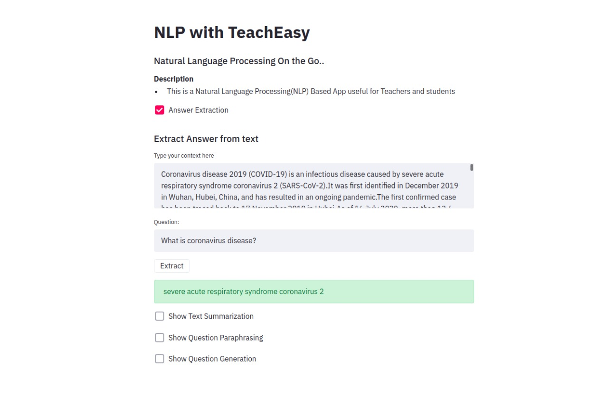
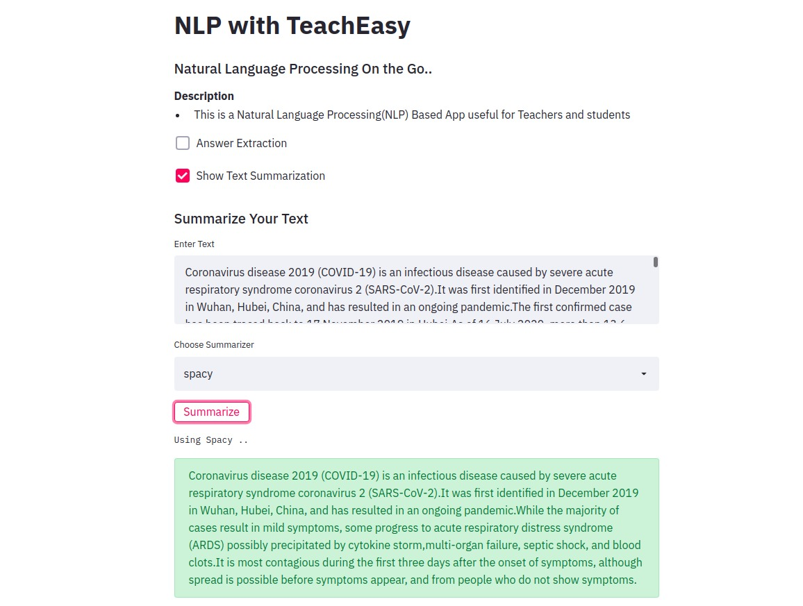
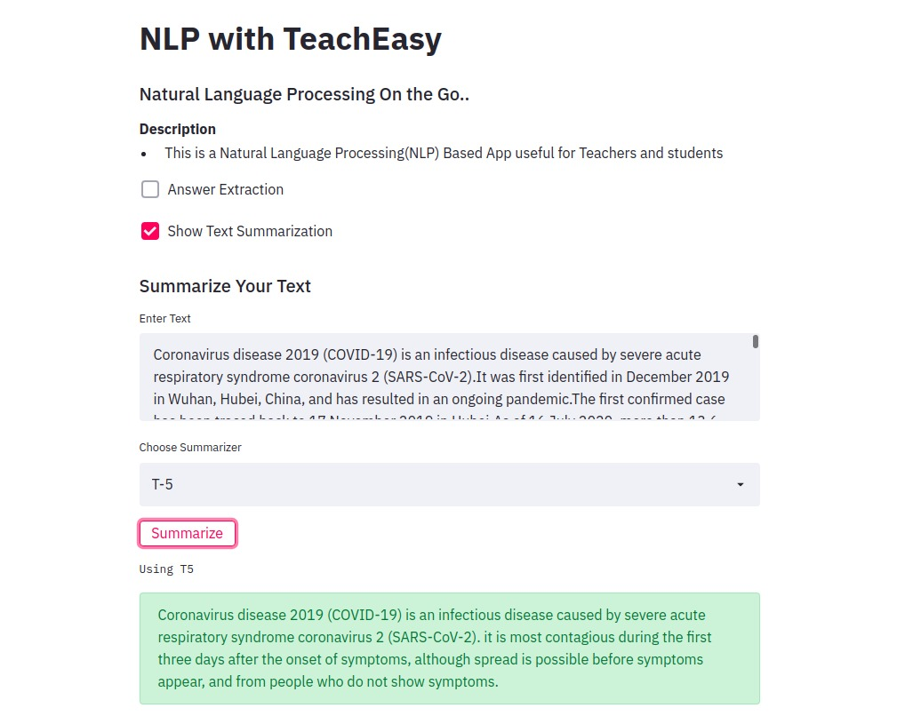
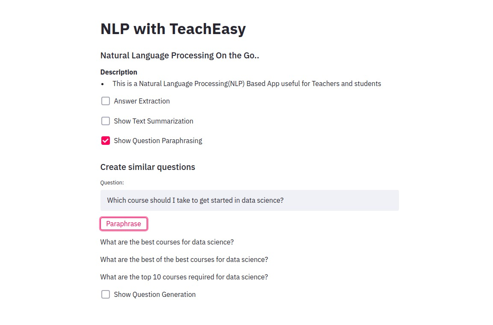
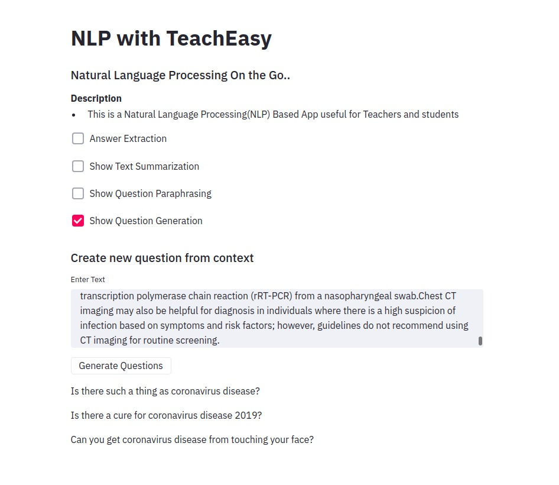

# TeachEasy
A tool for teachers and student.

<title> Main template interface </title>

<title> Answer extraction from questions </title>

<title> Summarization with spacy using Text Summarization( Extractive Summarization) </title>

<title> Summarization using T5 (Abstractive Summarization) </title>

<title> Paraphrasing of Question</title>

<title> Boolean Question generation </title>

